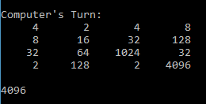

# 2048

Plays a game of [2048](https://en.wikipedia.org/wiki/2048_(video_game)) with a player AI using a [minimax](https://en.wikipedia.org/wiki/Minimax) algorithm with [alpha-beta pruning](https://en.wikipedia.org/wiki/Alpha%E2%80%93beta_pruning).  
It gets the 2048 tile about 90% of the time and the 4096 tile about 10% of the time.

## Environment

* Python 3

## Usage

```~$ python game_manager.py```

Example (4096 tile reached):



## Additional Notes

* Only a single heuristic was used to encourage larger valued tiles to stay in corners.
* More and better heuristics could be included to improve it  
(gotten close to getting the 8192 tile a few times).

